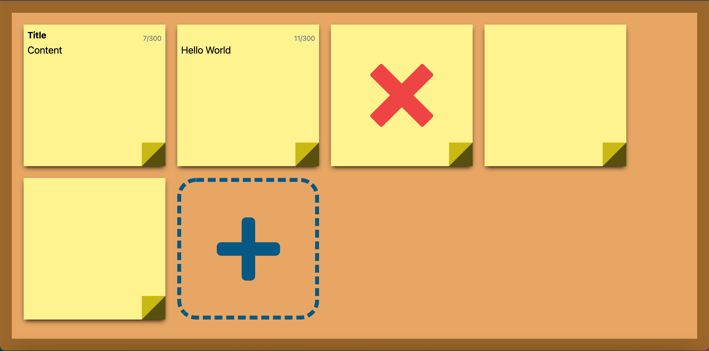
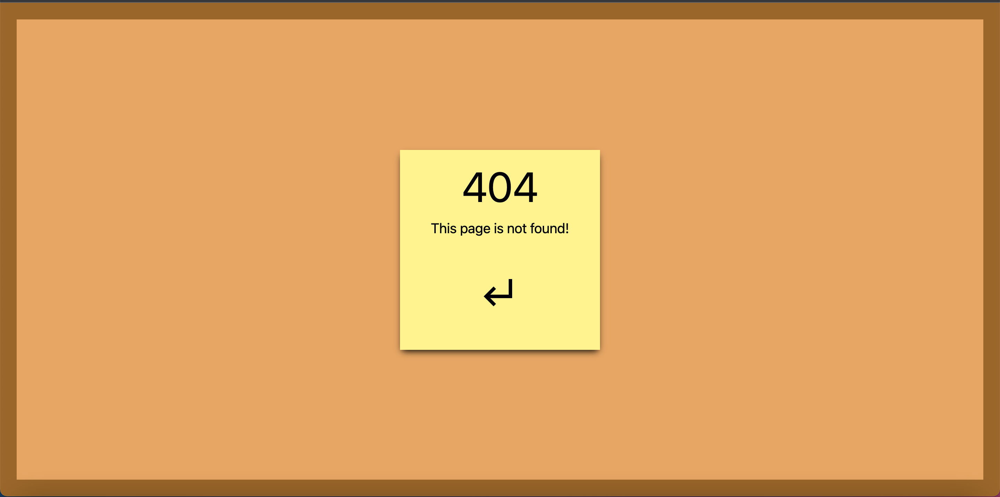

## Web Memo

This is a minimalistic Web Memo for writing memo online. It does not use cookie and has no save feature. Honestly, with Windows Notepad, Mac Notes, Notepad++, there is very little reason to ever use this. But it is available for everyone with internet connection, on computer or mobile phone, using any operating system, without downloading anything. It also saves a little bit of paper.

[Link to the web-memo website](https://hasuzawa.github.io/Web-Memo)

I have set a maximum of 100 memos at one time, but that is not due to technical limitation. Just like real life, you want to keep them organized.

It also has a simple custom 404 page. Try it out!

Tip: You can hold Enter when the add button is flashing to add many memo at once

## Screenshots

    
    

## Special Thanks

https://codepen.io/amit_sheen/pen/xxZeyjO
for creating dashed border with aribtary spacing between dashes

## Changelog

#### 2022

- v1.0.0 04-30 Published using Github pages.
- v1.0.1 04-30 Added tab select and keyboard listener for the Adder. Can now Hold Enter to create many memo at once.
- v1.0.2 04-30 Fixed routing issues. Added Esc to lose focus (blur) on add and delete.
- v1.0.3 04-30 Fixed HTML meta screenshot path and changed the png.
- v1.0.4 04-30 Refactored CSS. Changed how overflow behaves.
- v1.0.5 04-30 Added screenshots to readme.md
- v1.0.6 05-09 Changed Outer-frame width from 100vw to 100% to avoid vertical scrollbar causing horizontal overflow on Windows. Changed how appearance of dashed border and how it is presented. Increased limit of memo from 50 to 100.

